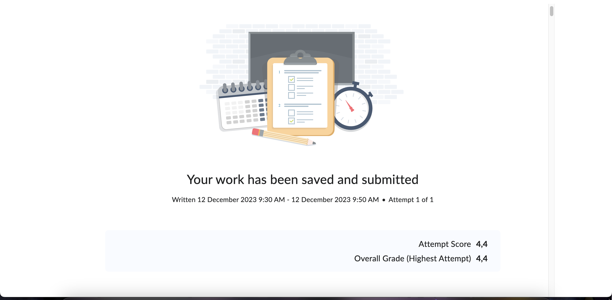

# OOP
OOP moet ik wat meer aan werken. Ik snap wel hoe het werkt maar het uitwerken is nog een ding waar ik aan moet werken
# Database
Van de database heb ik het grotendeels onder de knie. De schema's moet ik wel beter doornemen maar SQL heb ik helemaal door.
# UML
UML is een van de grotere punten waar ik aan moet werken. Ik heb nog moeite met de diagram lezen en het kunnen uitleggen.

