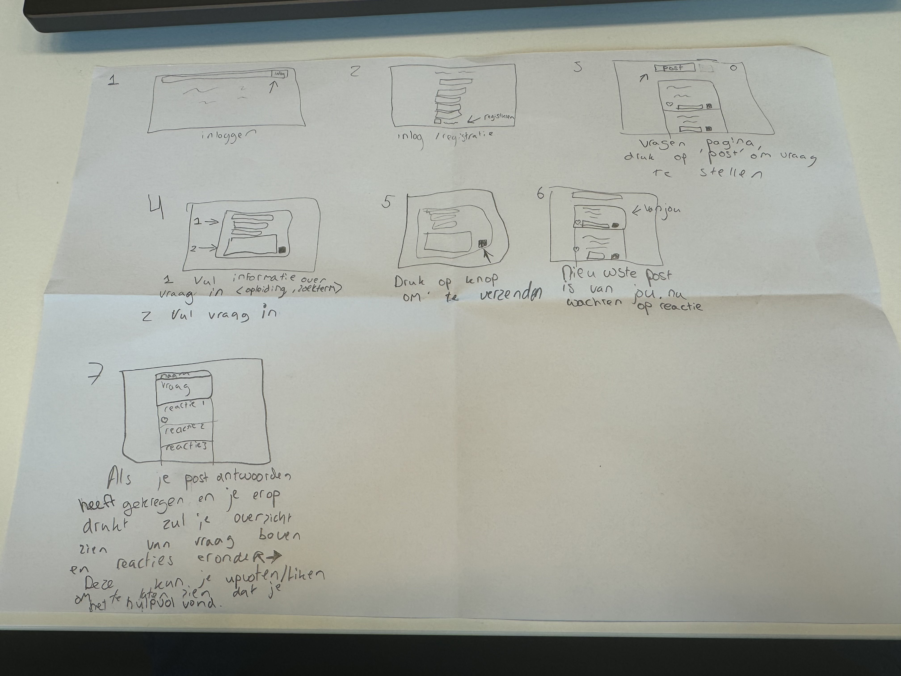

# Sprint planning:

## Anwar
Database tabellen gemaakt
## Tejash
Registratie pagina

# MOSCOW

## Must Have
Landingspagina
Loginpagina/Registratie pagina
Vragen pagina -> Vragen stellen/beantwoorden
Navbar
## Should Have
Overzicht vragen pagina -> Nieuwste vragen
Profiel kunnen bewerken
Recente vragen zien/Meest upvotes
Profiel verwijderen, vragen die de gebruiker heeft gesteld ook
Uitloggen
## Could Have
Prive berichten sturen
## Will Not Have

# Taskflow 
 
## Vragen pagina
Ga naar inlog pagina
Log in of registreer een account -> Vul gegevens in om te registreren
Druk op 'Post schrijven' om een vraag te stellen
Vul je vraag in de input field
Druk op 'Verzenden' om de vraag te verzenden, zodat andere mensen hem kunnen vinden.
Wacht totdat je een antwoord krijgt op je post.
Kijk of het antwoord geschikt is, zo ja druk je op post afronden zodat je kan laten zien aan andere dat de vraag beantwoord is.

