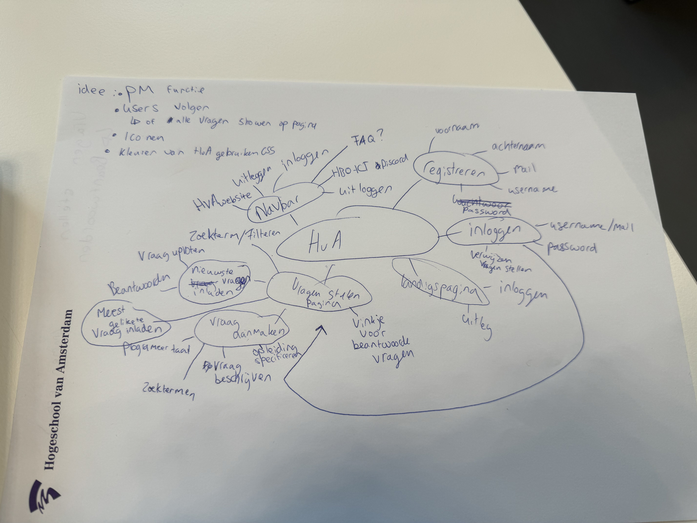

# Sprint 1
## Team leren kennen

### Waar ben jij goed in?
Anwar: Coderen en doorzetten
Tejash:Creatief zijn en goeie communicatie

Wat kan jij toevoegen in een team?

Anwar: Ik ben een teamspeler, ik vraag altijd hoe ver andere zijn en desnoods help ik wel.
Tejash:  Een harde werker, ik zal veel dingen proberen, opzoeken en vragen stellen wanneer nodig is.

### Waar ben jij graag mee bezig?
Anwar: Ik ben graag bezig met de functionaliteiten van de opdracht
Tejash: Ik ben graag bezig met de look en feel van de opdracht

### Wat heb jij nodig in een teamgenoot?
Anwar: Iemand die goed door werkt en niet tijd zit te verspillen
Tejash: Goeie communicatie en iemand die doorzet als het nodig is.

## Samenwerkingscontract
### Aanwezigheid:
Melden als iemand niet aanwezig is
### Omgang met elkaar:
Normaal met elkaar omgaan (niet elkaar uitschelden en normaal praten)
### Communicatiekanalen :
Wij gebruiken discord en snapchat om elkaar te berichten.
### Wat als iets niet lukt:
Als iets niet lukt melden we het elkaar en kijken we voor een oplossing
### Wat als iemand zich niet aan de afspraken :
Als iemand zich niet aan de afspraken houdt krijgt hij/zij eerst een opmerking. Daarna een waarschuwing en dan gaan we het opnemen naar de docent om dit optelossen

## Anwar en Tejash

# Mindmap/Interview

