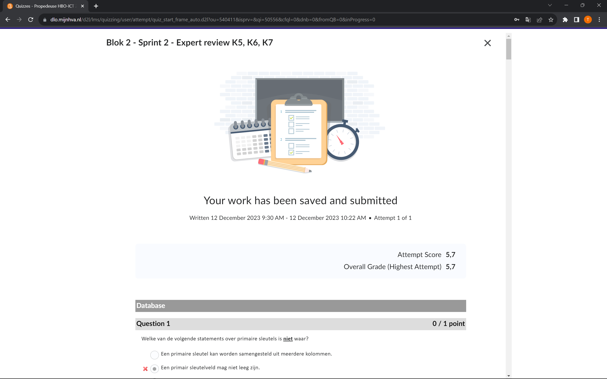

Voor de database vragen had ik 5/10 goed. Ik vind dit prima voor nu, ik heb niet echt veel gewerkt met databases zelf ontwerpen dus had niet zo veel kennis. Maar het ging wel redelijk. Ik had de innerjoin vraag van de datbase en wat betekenis vragen goed. Ik had vooral fouten met de ERD vragen, hier had ik maar 1 goed. Ik wist niet precies wat de lijnen inhielden, dit zal ik verder nog onderzoeken zodat ik het later wel snap. 

Voor de OOP vragen had ik 7/10 goed. Ik vind dit goed voor hoe nieuw dit onderwerp is voor mij. Ik ben dit blok pas begonnen met OOP leren en heb een heleboel vragen goed beantwoord. Ik had vooral de beteknis vragen en hoe dingen werken goed. De fouten die ik had waren voor de get/setters, abstraction en voor de for loop. Ik zat vooral te twijfelen voor deze vragen, ik had eigenlijk eerst de juiste antwoorden maar had ze toch uiteindelijk veranderd. 

Voor de UML vragen had ik 6/10 goed. Wat ik ook prima vind ten opzichte van hoe nieuw dit onderwerp ook voor mij is. Ik had vooral fouten bij sommige relaties en functies vragen van de klassen, ik zal volgende sprint wat meer onderzoek doen naar dit zodat ik het wel snap. Verder had ik wel de andere vragen van relaties en de betekenis van de pijlen goed. 